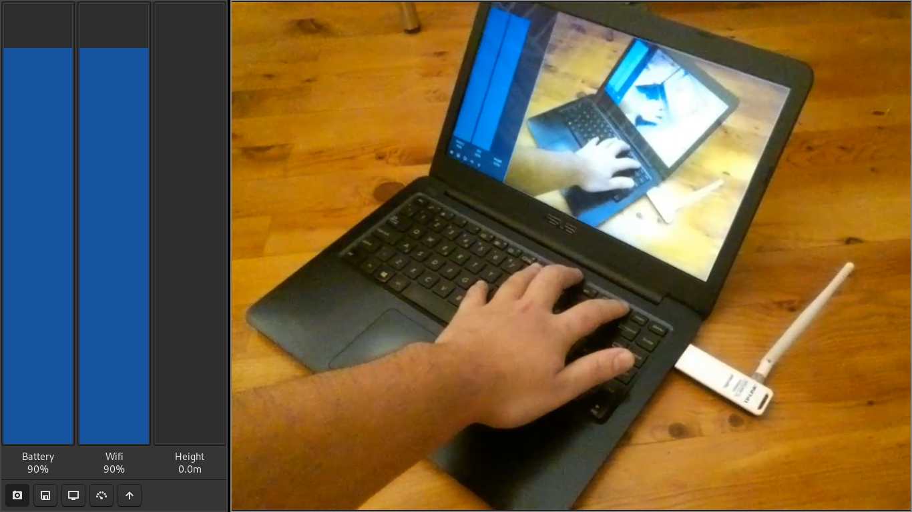

# DISCLAIMER

This code belongs to [Suphi](https://gitlab.com/Suphi), it is uploaded here for integration purposes with other github projects. For the original repository, see [here](https://gitlab.com/Suphi/Tello). 

---

### About
This project uses GTK to display tello data and also allows you to control your tello using a gamepad (tested on xbox 360 controller)

Uses ffplay to view the camera

- Start = Takeoff/Land
- Back = Start/Stop Recording Camera
- Button A = High/Low speed mode
- Button B = Camera Mode
- Button X = Save Position
- Button Y = Goto Save Position
- Space = Takeoff/Land
- Return = Scan for Gamepad


***
### Installation
```
make install
```
tello is installed into /usr/local by default this can be changed by setting DESTDIR.
```
make DESTDIR=/usr install
```
***
### Removal
```
make uninstall
```
***
### Custom Project Example
```c
#include "tello.h"
#include <stdio.h>
#include <string.h>
#include <math.h>

// create a tello object this will hold all the information of the tello
struct tello tello;

// when the tello sends us data this function will be called
void tello_data_callback(int id)
{
	// print drones forward vector
	float q[] = {tello.rotation_x, tello.rotation_y, tello.rotation_z, tello.rotation_w};
	float v[] = {2 * (q[0]*q[2] + q[3]*q[1]), 2 * (q[1]*q[2] - q[3]*q[0]), 1 - 2 * (q[0]*q[0] + q[1]*q[1])};
	printf("%f, %f, %f\n", v[0], v[1], v[2])
}

// when the tello sends camera data this function will be called
void tello_camera_callback(uint8_t *data, int size)
{
	printf("Camera data size: %d\n", size);
}

int main(int argc, char *argv[])
{
	// connect to tello with the camera port 6038 and a timeout of 2 seconds
	while (tello_connect(&tello, 6038, 2) < 0) printf("Connection Failed\n");

	// register are tello data callback
	tello.data_callback = &tello_data_callback;

	// register are tello camera data callback
	//tello.camera_callback = &tello_camera_callback;

	// start loop
	while (1) {
		// wait for command (enter key)
		char input[512]; fgets(input, 512, stdin); input[strcspn(input, "\n")] = '\0';
		if (strcmp(input, "takeoff") == 0) tello_takeoff(&tello);
		if (strcmp(input, "land") == 0) tello_land(&tello);
		if (strcmp(input, "exit") == 0) break;
	}

	// disconnect the tello
	tello_disconnect(&tello);
}

```
